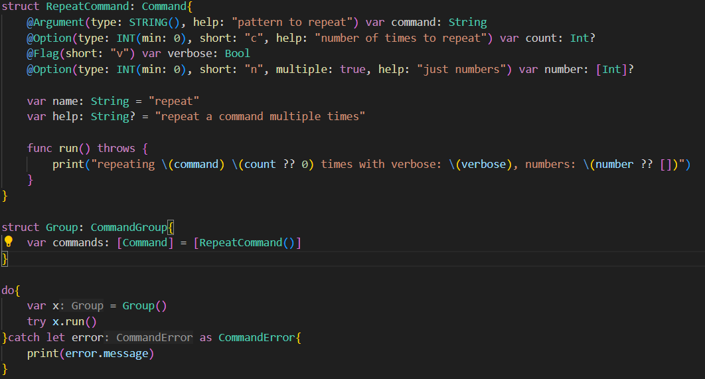

# cli-builder

cli-builder is a command line interface builder for swift. It helps you define a cli interface with a simple and intuitive api.

## Example



### Command
```
repeat -h
```
#### Output
```
repeat COMMAND

repeat a command multiple times

Arguments:
  COMMAND        pattern to repeat

Options:
  --number, -n   just numbers
  --count, -c    number of times to repeat

Flags:
  verbose, -v
```

### Command
```
repeat message -c 3 -v -n 1 -n 2 -n 3
```
#### Output
```
repeating message 3 times with verbose: true, numbers: [1, 2, 3]
```